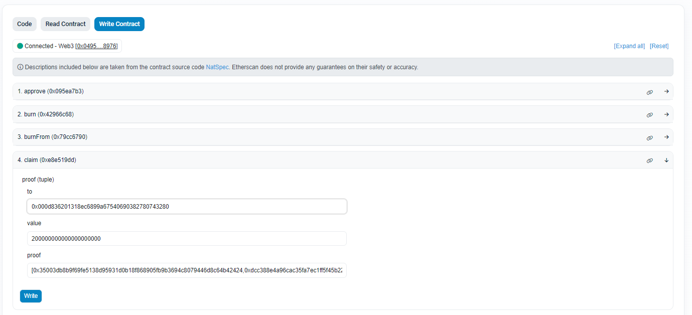

How to get hired by Ethereum OG's:  
1. Get the Ethereum genesis data (address and amount).  
2. Create a script to create a merkle tree and take note of the merkle root and the merkle proofs of each entry.  
3. Create a an immutable smart contract for an ERC20 token named OG.  
4. Include a merkle airdrop in the contract where anyone can call a claim function and claim OG tokens.  
5. Upload everything on github and deploy the smart contract.  
6. Let everyone verify that everything is fairly and honestly done.  
7. Publish your Ethereum address where they can donate to you OG tokens as your salary.  
8. Let them realize that the donations made will be used to build more value for OG tokens.  
9. Be grateful that blockchain allows you to have a job without the need to be interviewed by your potential employers.  
10. Enjoy what you do and be passionate.  
11. Keep on learning and building.  

OG contract: https://etherscan.io/address/0x6d7033b9301db0e559c4a13d52b8e1b819bf2e8a  
Github: https://github.com/ph4n70mr1ddl3r/og  
Telegram: https://t.me/strictlydecentralized  
Twitter: https://twitter.com/ph4n70mr1ddl3r  
Donation: 0x049555e1c25Ea977aC10ab5B65713Cce31608976  

Notes:  
Anyone can pay the gas and execute the claim but the OG tokens will always go to the genesis holders.  
A few test claims will be executed.  
All the data needed to claim is already calculated and stored in proofs.txt just pass the data in the claim function of the contract.  

Sample claim using etherscan write contract:
https://etherscan.io/address/0x6d7033b9301db0e559c4a13d52b8e1b819bf2e8a#writeContract

